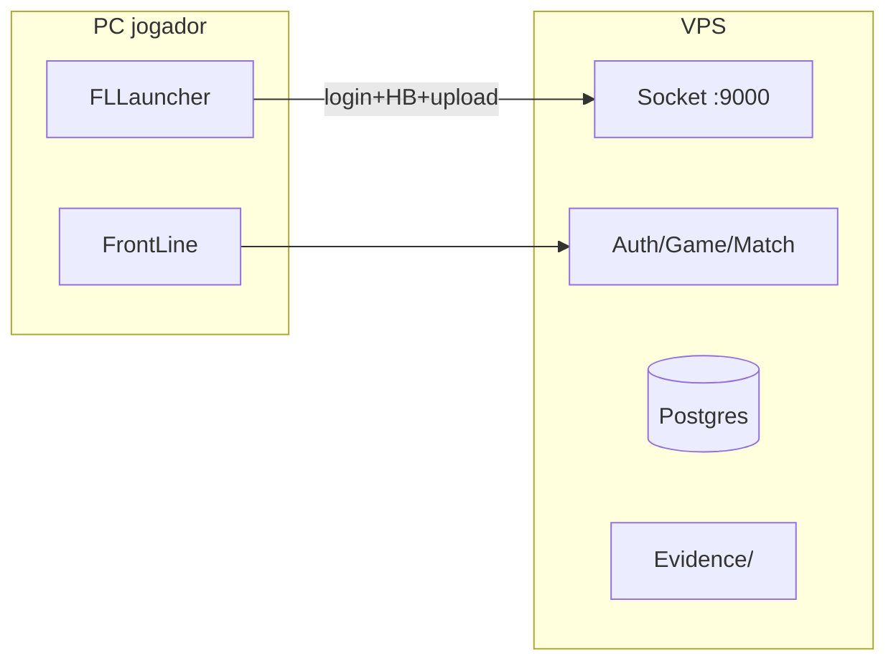

# Segurança + servidor + client FrontLine

## Foco atual (painel GM cortado)

Painel web **removido** (`servidor/FL.GmPanel` apagado). Ops GM por enquanto: **FLMonitor / RCON / DB**. Painel novo = depois, outra forma.

**Prioridade agora:**

1. Segurança servidor (Match anti-burst já feito; validar Auth OTP/HB/hardban no deploy)
2. Client + launcher (integridade FL Guard, FileList, config Socket fora da lista)
3. Deploy VPS (GitHub privado + Docker + patch pelo Socket)

---

## Cloudflare gratuito — o que dá e o que não dá

- **Dá (proxy laranja):** só faz sentido quando existir painel/site HTTP de novo.
- **Não dá:** Auth TCP `39190`, Game `39191–93`, Match UDP `40009`, Socket `9000` **não passam** pelo proxy Cloudflare Free. Ficam **DNS cinza** ou IP direto. Mitigação DDoS de jogo = firewall da VPS + anti-abuso no app.

## Ordem de entrega (segurança primeiro)

### Fase 1 — Segurança do servidor (prioridade)

1. **Socket na VPS, não no PC do jogador**
   - Launcher aponta IP/host da VPS (não localhost).
   - [`SocketBootstrap`](launcher/Point Blank Launcher/Launcher.PointBlank/Services/SocketBootstrap.cs) já **não** sobe Socket local se o host for remoto.
   - Evidências em `Evidence/{player_id}/` **na VPS**.

2. **Harden de rede na VPS (script + doc)**
   - Abrir só: Auth/Game/Match/Socket necessários.
   - RCON `30000` **só localhost**.
   - Postgres **não** exposto na internet.
   - Documentar no [`servidor/README.md`](servidor/README.md) ou `servidor/linux/`.

3. **Match: fechar o “mata geral de uma vez”**
   - Contador KPS / headshot% / kills em janela → FG-12x + clip + kick (feito).
   - Manter `AntiScript=True` em produção.

4. **Auth/Game** (`RequireOtpToken`, heartbeat, hardban) — validar no deploy VPS.

### Fase 2 — Painel GM

**Cancelado por enquanto** (código removido). Refazer depois.

### Fase 3 — Cloudflare + DNS

Adiado junto com o painel. Jogo sobe com **IP** (ou DNS cinza).

---

## Deploy antes / na VPS

- Repo **privado** GitHub; secrets fora do git.
- Docker compose Auth/Game/Match/Socket.
- Patch client/launcher pelo **Socket** (FileListBuilder + pasta patch), não GitHub no PC do jogador.

**Update obrigatório?** Sim, quando houver bump de versão no Socket — Start bloqueado até atualizar.

---

## Fora do escopo imediato

- Aimbot FOV completo; DDoS L3/L4; SQL editor livre; Discord bot; painel GM novo.

## Critério de “pronto” Fase 1

- Socket + Evidence na VPS; launcher remoto conecta.
- Firewall doc/script aplicado.
- Burst impossível → flag+clip+kick em teste.
- RCON não escuta internet pública.

## Critério de “pronto” deploy mínimo

- Repo privado + `.gitignore` de segredos.
- Compose na VPS sobe Auth/Game/Match/Socket.
- Patch de teste baixa pelo launcher no IP da VPS.
