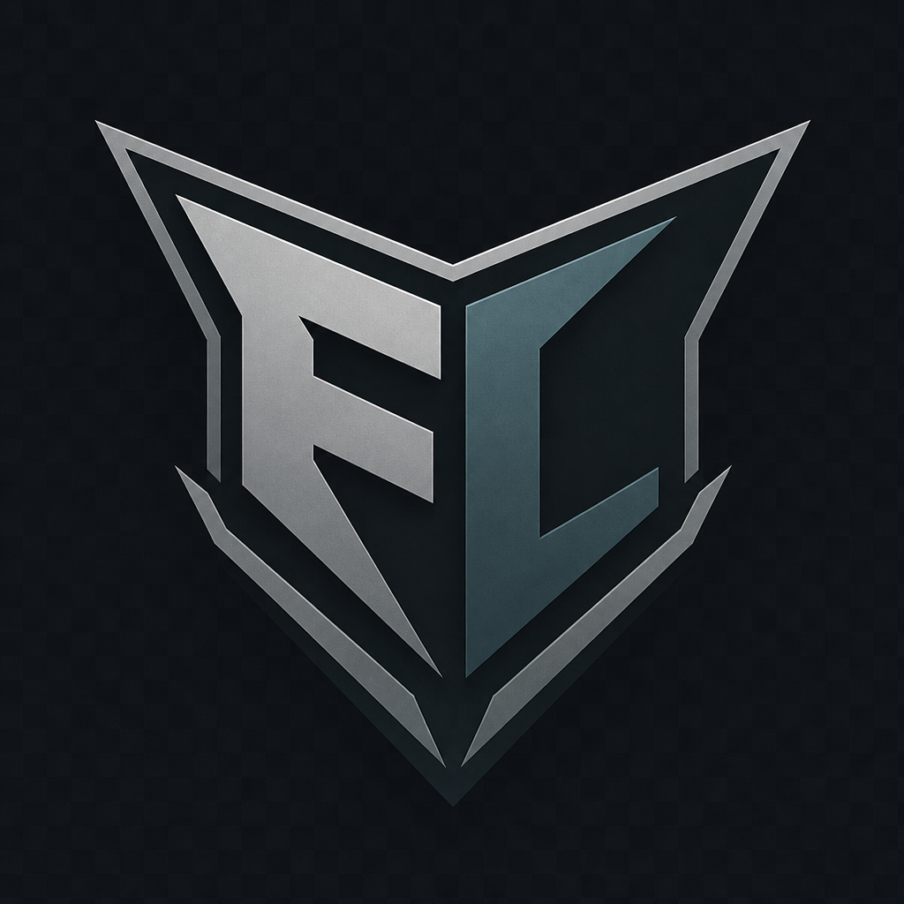

<p align="center">
  
</p>

<h1 align="center">FrontLine Server</h1>

<p align="center">
  <b>Servidor · Launcher · Banco</b> para Point Blank (client FrontLine / 3.122 BR)
</p>

<p align="center">
  
  
  
  
  
</p>

---

## O que tem aqui

| Pasta | Conteúdo |
|:-----:|----------|
| [`servidor/`](servidor/) | Auth · Game · Match · FLMonitor · Docker · hardening VPS |
| [`launcher/`](launcher/) | FLLauncher · Socket (patch/login/heartbeat) · FLConfig |
| [`database/`](database/) | Dump + migrations PostgreSQL |

Client completo, packs e EXEs de publish **não** entram no Git — patch sobe pelo Socket.

---

## Arquitetura rápida

```text
  Jogador                         VPS
 ─────────                       ─────
  FLLauncher ──TCP :9000──► Socket (+ Evidence)
       │
  FrontLine ──TCP 39190───► Auth
            ──TCP 39191+──► Game
            ──UDP 40009───► Match
                              │
                         PostgreSQL (só rede local)
```

---

## Começar

1. **Banco** — veja [`database/README.md`](database/README.md)
2. **Servidor** — veja [`servidor/README.md`](servidor/README.md) (Windows / Docker / Linux)
3. **Launcher** — veja [`launcher/README.md`](launcher/README.md)
4. **Segurança VPS** — veja [`servidor/linux/SECURITY.md`](servidor/linux/SECURITY.md)

---

## Portas (produção)

| Serviço | Porta | Exposição |
|---------|-------|-----------|
| Socket (launcher) | `9000` TCP | Público |
| Auth | `39190` TCP | Público |
| Game | `39191`–`39193` TCP | Público |
| Match | `40009` UDP | Público |
| RCON | `30000` TCP | **Só localhost** |
| PostgreSQL | `5432` / `5433` | **Só localhost / Docker** |

---

## Segurança (resumo)

- OTP + heartbeat do launcher (FL Guard)
- Match anti-burst (FG-124 + clip + kick)
- Evidence na VPS, não no PC do jogador
- Secrets só em `.env` / INI local — nunca no Git

---

## Licença / uso

Repositório **privado**. Código e assets para operação do FrontLine — não redistribuir client oficial de terceiros.
