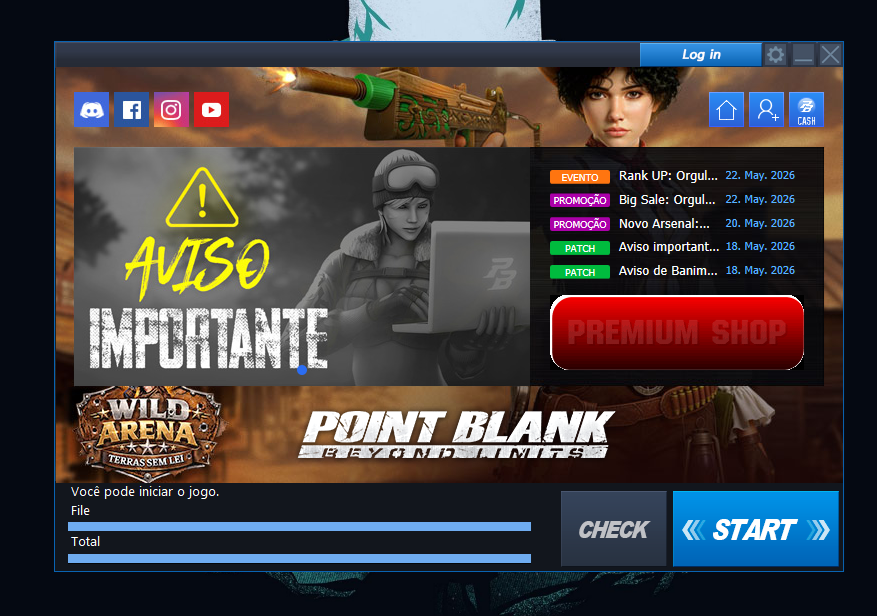
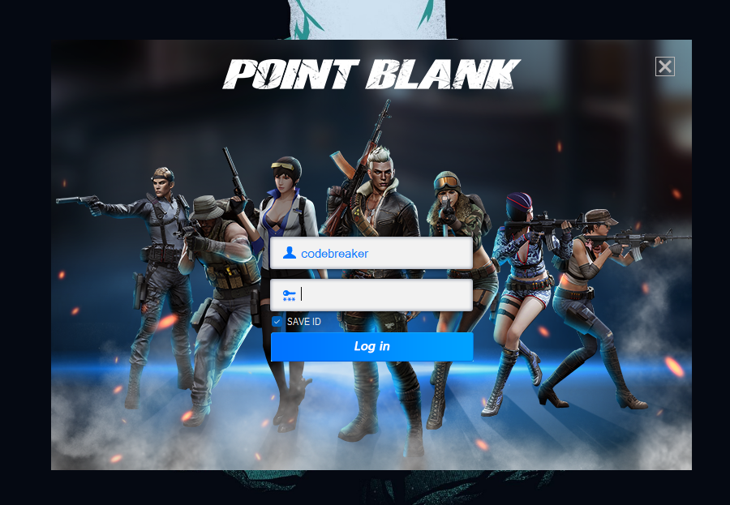
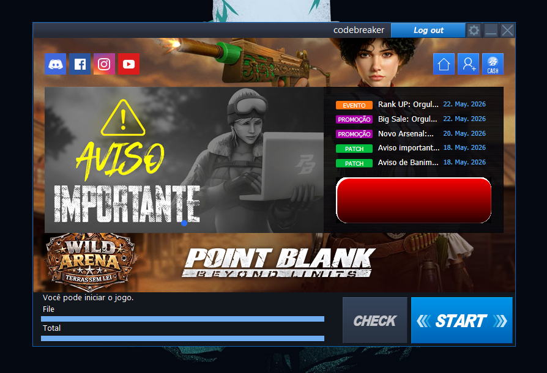
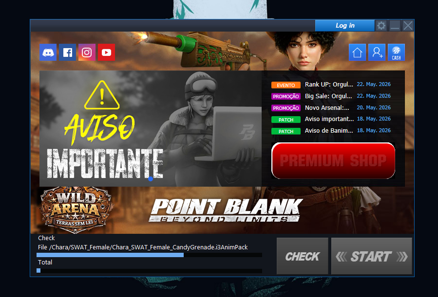
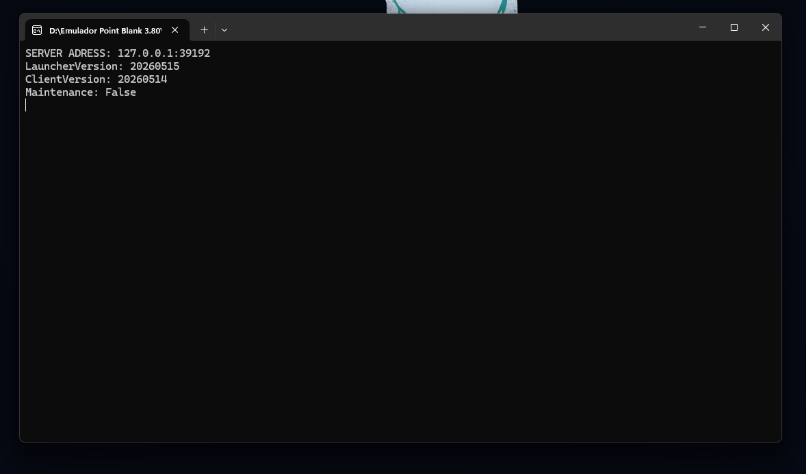

# Launcher FrontLine

Launcher, Socket de patch/login e ferramentas de config para o client **FrontLine** (base Point Blank).

---

## Projetos

| Projeto | Executável | Stack | Função |
|---------|------------|-------|--------|
| `Launcher.PointBlank` | `FLLauncher` | C# · WinForms · .NET 4.8 | UI do launcher |
| `Launcher.Services` | `Socket` / serviço TCP | C# · Console · .NET 4.8 | Login, patch, heartbeat |
| `FLConfig` | `FLConfig` | C# | Gerenciador de config |
| Update Creator | (opcional) | C++ | Pacotes de atualização |

---

## Screenshots

| Launcher | Login |
|:---:|:---:|
|  |  |

| Logado | Verificação de arquivos |
|:---:|:---:|
|  |  |

**Socket TCP**



---

## Arquitetura

```text
FLLauncher  ──TCP──►  Socket (VPS :9000)  ──►  PostgreSQL
                           │
                           ├── Data\Client\     (patch)
                           ├── Data\Launcher\
                           └── Evidence\{id}\   (só na VPS)
```

1. Launcher conecta ao Socket na inicialização  
2. Serviço confere versões (launcher + client)  
3. Login (senha em MD5 no protocolo do serviço)  
4. Integridade / download de patch via TCP  
5. Jogo sobe com token OTP + heartbeat do Guard  

Com host **remoto**, o launcher **não** sobe Socket local.

---

## Protocolo TCP

```text
[ Opcode : 2 bytes ] [ Length : 4 bytes ] [ Payload : N bytes ]
```

| Faixa | Operação |
|-------|----------|
| `1000–1002` | Conexão |
| `2000–2002` | Manifest |
| `3000–3004` | Transferência de arquivos |
| `4000–4002` | Login |
| `9000` | Erro genérico |

---

## Configuração do Socket

Arquivo típico: `Config/config.ini` (ou equivalente no publish):

```ini
[Server]
Host=0.0.0.0
Port=9000

[Launcher]
LauncherVersion=20260515
ClientVersion=20260514
Maintenance=false
MaintenanceMessage=Servidor em manutenção.

[Patch]
ManifestPath=Info\list.json
ClientFilesPath=Data\Client
LauncherFilesPath=Data\Launcher

[Database]
Host=127.0.0.1
Port=5432
Name=pb
User=postgres
Pass=suasenha
```

No PC do jogador, o IP do launcher aponta para a **VPS**, não `127.0.0.1`.

---

## Banco

- PostgreSQL · tabela `accounts`
- Login do launcher usa `username` / `password` (MD5 lowercase no fluxo do Socket)
- Auth do jogo usa **token OTP** gerado pelo Socket (ver Guard)

```sql
INSERT INTO accounts (username, password)
VALUES ('seuUsuario', md5('suaSenha'));
```

---

## Build

1. Abra a solution no **Visual Studio 2022+**
2. Restaure NuGet
3. Compile **Release**
4. Saídas em `bin\Release\` (ou `_publish` local — **não** versionar EXEs grandes)

### Dependências principais

| Pacote | Uso |
|--------|-----|
| Newtonsoft.Json | Launcher + Socket |
| Npgsql | Socket |

---

## Requisitos

- Windows 10/11  
- .NET Framework 4.8  
- PostgreSQL 14+ (no servidor do Socket)  
- Visual Studio 2022 (para compilar)  
